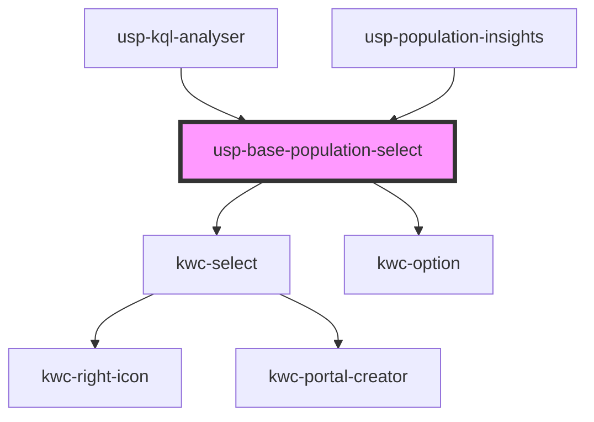

# usp-base-population-select

<!-- Auto Generated Below -->

## Dependencies

### Used by

 - [usp-kql-analyser](../kql-analyser)
 - [usp-population-insights](../population-insights)

### Depends on

- kwc-select
- kwc-option

### Graph

----------------------------------------------

*Built with [StencilJS](https://stenciljs.com/)*
