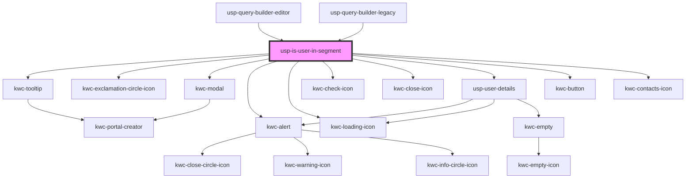

# usp-is-user-in-segment

<!-- Auto Generated Below -->

## Dependencies

### Used by

 - [usp-query-builder-editor](../query-builder-editor)
 - [usp-query-builder-legacy](../query-builder-legacy)

### Depends on

- kwc-tooltip
- kwc-exclamation-circle-icon
- kwc-modal
- kwc-alert
- kwc-loading-icon
- kwc-check-icon
- kwc-close-icon
- [usp-user-details](../user-details)
- kwc-button
- kwc-contacts-icon

### Graph

----------------------------------------------

*Built with [StencilJS](https://stenciljs.com/)*
