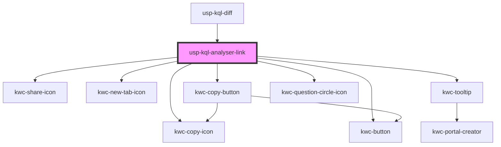

# usp-kql-analyser-link

<!-- Auto Generated Below -->

## Dependencies

### Used by

 - [usp-kql-diff](../kql-diff)

### Depends on

- kwc-copy-icon
- kwc-share-icon
- kwc-new-tab-icon
- kwc-copy-button
- kwc-tooltip
- kwc-question-circle-icon
- kwc-button

### Graph

----------------------------------------------

*Built with [StencilJS](https://stenciljs.com/)*
