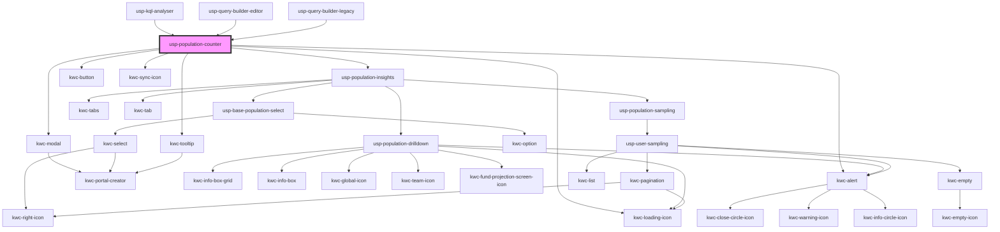

# usp-population-counter

<!-- Auto Generated Below -->

## Dependencies

### Used by

 - [usp-kql-analyser](../kql-analyser)
 - [usp-query-builder-editor](../query-builder-editor)
 - [usp-query-builder-legacy](../query-builder-legacy)

### Depends on

- kwc-modal
- [usp-population-insights](../population-insights)
- kwc-tooltip
- kwc-loading-icon
- kwc-button
- kwc-sync-icon
- kwc-alert

### Graph

----------------------------------------------

*Built with [StencilJS](https://stenciljs.com/)*
