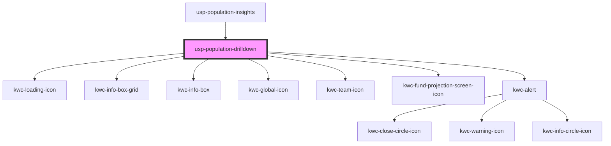

# usp-population-drilldown

<!-- Auto Generated Below -->

## Dependencies

### Used by

 - [usp-population-insights](../population-insights)

### Depends on

- kwc-loading-icon
- kwc-info-box-grid
- kwc-info-box
- kwc-global-icon
- kwc-team-icon
- kwc-fund-projection-screen-icon
- kwc-alert

### Graph

----------------------------------------------

*Built with [StencilJS](https://stenciljs.com/)*
