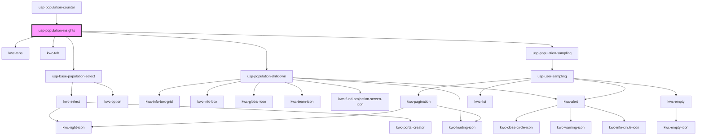

# usp-population-insights

<!-- Auto Generated Below -->

## Dependencies

### Used by

 - [usp-population-counter](../population-counter)

### Depends on

- [usp-base-population-select](../base-population-select)
- kwc-tabs
- kwc-tab
- [usp-population-drilldown](../population-drilldown)
- [usp-population-sampling](../population-sampling)

### Graph

----------------------------------------------

*Built with [StencilJS](https://stenciljs.com/)*
