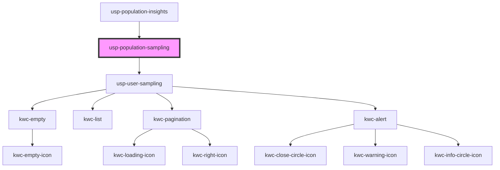

# usp-population-sampling

<!-- Auto Generated Below -->

## Dependencies

### Used by

 - [usp-population-insights](../population-insights)

### Depends on

- [usp-user-sampling](../user-sampling)

### Graph

----------------------------------------------

*Built with [StencilJS](https://stenciljs.com/)*
