# usp-query-builder-legacy

<!-- Auto Generated Below -->

## Dependencies

### Used by

 - [usp-query-builder](../query-builder)

### Depends on

- kwc-exclamation-circle-icon
- kwc-warning-icon
- kwc-loading-icon
- kwc-check-circle-icon
- kwc-tooltip
- kwc-modal
- kwc-alert
- [usp-text-input](../text-input)
- [usp-autocomplete](../autocomplete)
- [usp-population-counter](../population-counter)
- [usp-kql-help](../kql-help)
- kwc-button
- kwc-sync-icon
- kwc-copy-button
- kwc-user-icon
- [usp-is-user-in-segment](../is-user-in-segment)

### Graph

```mermaid
graph TD;
  usp-query-builder-legacy --> kwc-exclamation-circle-icon
  usp-query-builder-legacy --> kwc-warning-icon
  usp-query-builder-legacy --> kwc-loading-icon
  usp-query-builder-legacy --> kwc-check-circle-icon
  usp-query-builder-legacy --> kwc-tooltip
  usp-query-builder-legacy --> kwc-modal
  usp-query-builder-legacy --> kwc-alert
  usp-query-builder-legacy --> usp-text-input
  usp-query-builder-legacy --> usp-autocomplete
  usp-query-builder-legacy --> usp-population-counter
  usp-query-builder-legacy --> usp-kql-help
  usp-query-builder-legacy --> kwc-button
  usp-query-builder-legacy --> kwc-sync-icon
  usp-query-builder-legacy --> kwc-copy-button
  usp-query-builder-legacy --> kwc-user-icon
  usp-query-builder-legacy --> usp-is-user-in-segment
  kwc-tooltip --> kwc-portal-creator
  kwc-modal --> kwc-portal-creator
  kwc-alert --> kwc-close-circle-icon
  kwc-alert --> kwc-warning-icon
  kwc-alert --> kwc-info-circle-icon
  usp-autocomplete --> kwc-portal-creator
  usp-population-counter --> kwc-modal
  usp-population-counter --> usp-population-insights
  usp-population-counter --> kwc-tooltip
  usp-population-counter --> kwc-loading-icon
  usp-population-counter --> kwc-button
  usp-population-counter --> kwc-sync-icon
  usp-population-counter --> kwc-alert
  usp-population-insights --> usp-base-population-select
  usp-population-insights --> kwc-tabs
  usp-population-insights --> kwc-tab
  usp-population-insights --> usp-population-drilldown
  usp-population-insights --> usp-population-sampling
  usp-base-population-select --> kwc-select
  usp-base-population-select --> kwc-option
  kwc-select --> kwc-right-icon
  kwc-select --> kwc-portal-creator
  usp-population-drilldown --> kwc-loading-icon
  usp-population-drilldown --> kwc-info-box-grid
  usp-population-drilldown --> kwc-info-box
  usp-population-drilldown --> kwc-global-icon
  usp-population-drilldown --> kwc-team-icon
  usp-population-drilldown --> kwc-fund-projection-screen-icon
  usp-population-drilldown --> kwc-alert
  usp-population-sampling --> usp-user-sampling
  usp-user-sampling --> kwc-empty
  usp-user-sampling --> kwc-list
  usp-user-sampling --> kwc-pagination
  usp-user-sampling --> kwc-alert
  kwc-empty --> kwc-empty-icon
  kwc-pagination --> kwc-loading-icon
  kwc-pagination --> kwc-right-icon
  usp-kql-help --> kwc-button
  usp-kql-help --> kwc-question-circle-icon
  usp-kql-help --> kwc-portal-creator
  kwc-copy-button --> kwc-button
  kwc-copy-button --> kwc-copy-icon
  usp-is-user-in-segment --> kwc-tooltip
  usp-is-user-in-segment --> kwc-exclamation-circle-icon
  usp-is-user-in-segment --> kwc-modal
  usp-is-user-in-segment --> kwc-alert
  usp-is-user-in-segment --> kwc-loading-icon
  usp-is-user-in-segment --> kwc-check-icon
  usp-is-user-in-segment --> kwc-close-icon
  usp-is-user-in-segment --> usp-user-details
  usp-is-user-in-segment --> kwc-button
  usp-is-user-in-segment --> kwc-contacts-icon
  usp-user-details --> kwc-alert
  usp-user-details --> kwc-loading-icon
  usp-user-details --> kwc-empty
  usp-query-builder --> usp-query-builder-legacy
  style usp-query-builder-legacy fill:#f9f,stroke:#333,stroke-width:4px
```

----------------------------------------------

*Built with [StencilJS](https://stenciljs.com/)*
