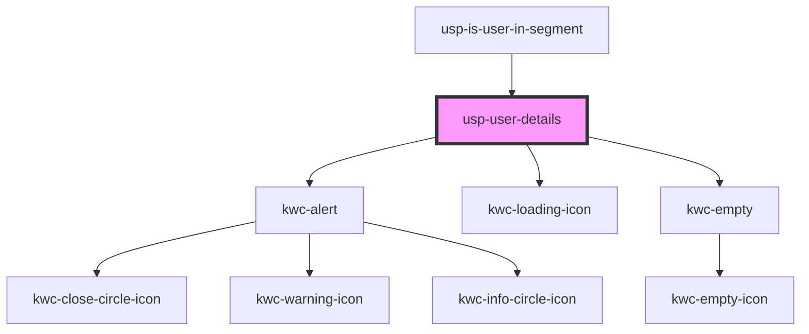

# usp-user-details

<!-- Auto Generated Below -->

## Dependencies

### Used by

 - [usp-is-user-in-segment](../is-user-in-segment)

### Depends on

- kwc-alert
- kwc-loading-icon
- kwc-empty

### Graph

----------------------------------------------

*Built with [StencilJS](https://stenciljs.com/)*
