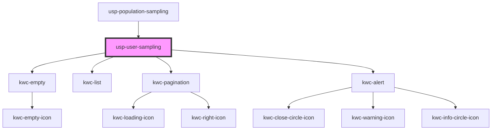

# usp-user-sampling

<!-- Auto Generated Below -->

## Dependencies

### Used by

 - [usp-population-sampling](../population-sampling)

### Depends on

- kwc-empty
- kwc-list
- kwc-pagination
- kwc-alert

### Graph

----------------------------------------------

*Built with [StencilJS](https://stenciljs.com/)*
