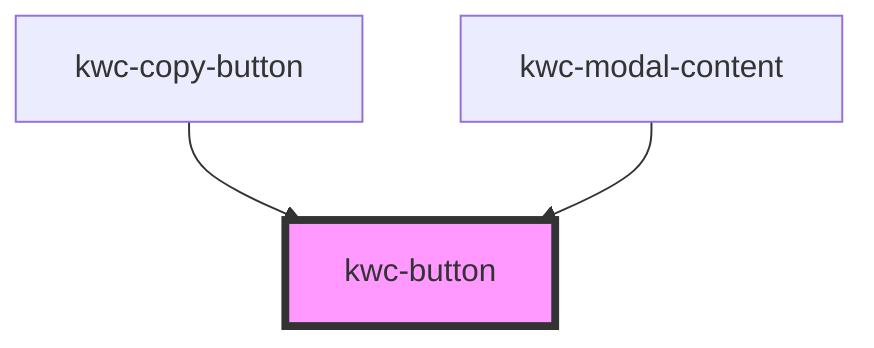

# kwc-button

<!-- Auto Generated Below -->

## Dependencies

### Used by

 - [kwc-copy-button](../copy-button)
 - [kwc-modal-content](../modal)

### Graph

----------------------------------------------

*Built with [StencilJS](https://stenciljs.com/)*
