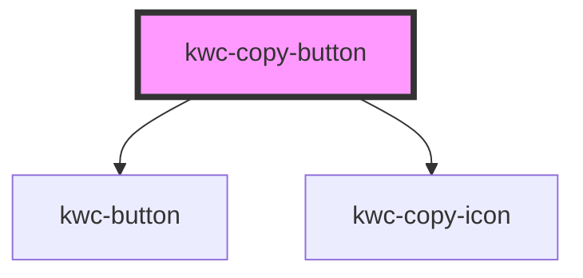

# kwc-copy-button

<!-- Auto Generated Below -->

## Dependencies

### Depends on

- [kwc-button](../button)
- [kwc-copy-icon](../icon-copy)

### Graph

----------------------------------------------

*Built with [StencilJS](https://stenciljs.com/)*
