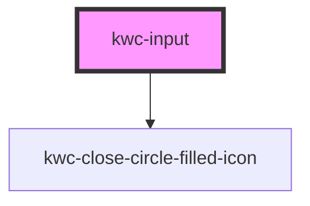

# kwc-input

<!-- Auto Generated Below -->

## Dependencies

### Depends on

- [kwc-close-circle-filled-icon](../icon-close-circle-filled)

### Graph

----------------------------------------------

*Built with [StencilJS](https://stenciljs.com/)*
