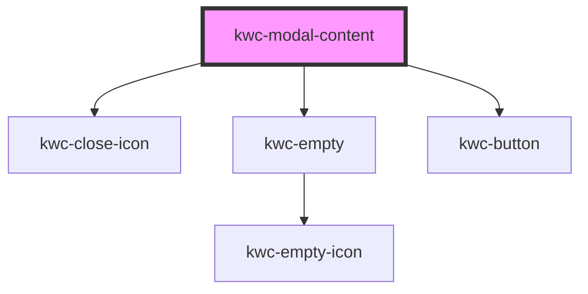

# kwc-modal-content

<!-- Auto Generated Below -->

## Dependencies

### Depends on

- [kwc-close-icon](../icon-close)
- [kwc-empty](../empty)
- [kwc-button](../button)

### Graph

----------------------------------------------

*Built with [StencilJS](https://stenciljs.com/)*
